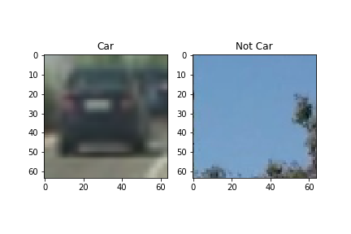
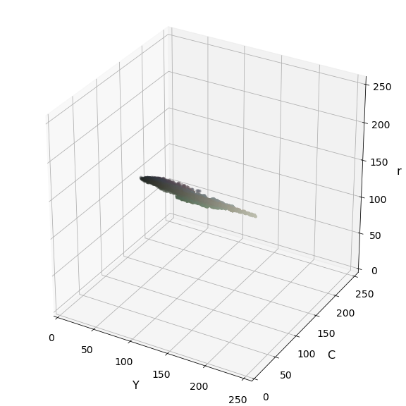
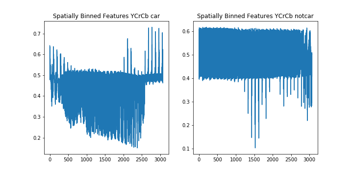
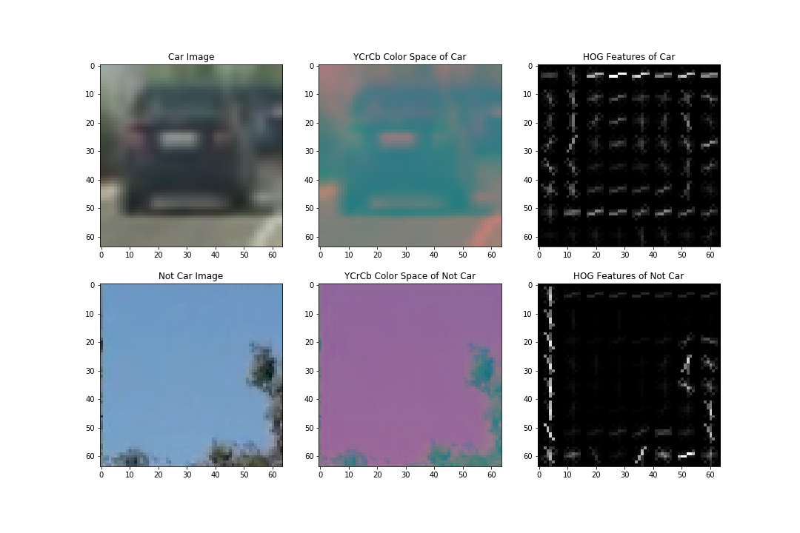
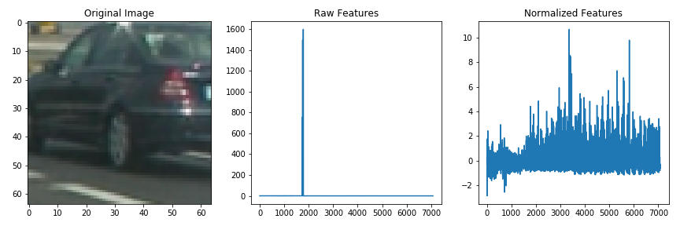
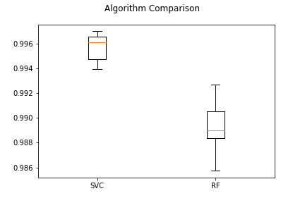
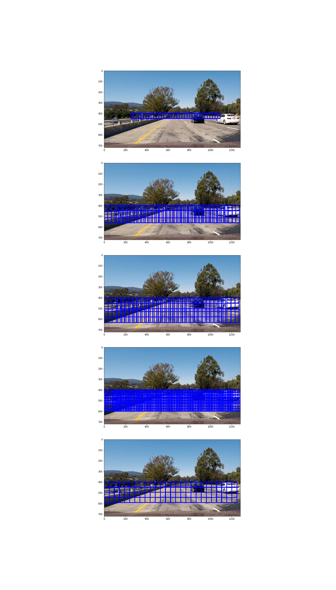
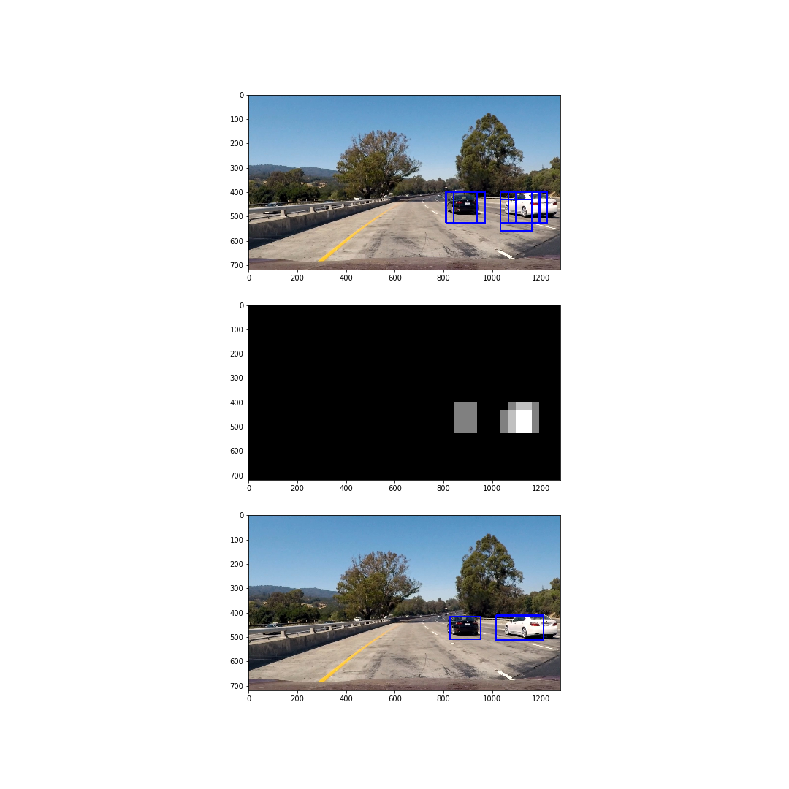
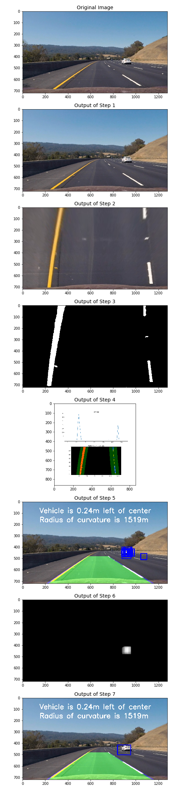

# Vehicle Detection
The goal of this project is to write a software pipeline to identify vehicles in a video from a front-facing camera on a car.

The steps of this project are the following:

* Perform a Histogram of Oriented Gradients (HOG) feature extraction on a labeled training set of images and train a classifier Linear SVM classifier
* Apply a color transform and append binned color features, as well as histograms of color, to the HOG feature vector.
* Implement a sliding-window technique and use the trained classifier to search for vehicles in images.
* Run the pipeline on a video stream and create a heat map of recurring detections frame by frame to reject outliers and follow detected vehicles.
* Estimate a bounding box for vehicles detected.

---

## Data Extraction

This project, was provide with a labeled dataset and the job is to decide what features to extract, then train a classifier and ultimately track vehicles in a video stream. Here are links to the labeled data for [vehicle](https://s3.amazonaws.com/udacity-sdc/Vehicle_Tracking/vehicles.zip) and [non-vehicle](https://s3.amazonaws.com/udacity-sdc/Vehicle_Tracking/non-vehicles.zip) examples to train the classifier. These example images come from a combination of the [GTI vehicle image database](http://www.gti.ssr.upm.es/data/Vehicle_database.html), the [KITTI vision benchmark suite](http://www.cvlibs.net/datasets/kitti/), and examples extracted from the project video itself.

---

## Data Exploration

- Number of examples for cars: 8792
- Number of examples for not cars: 17936
- Shape of cars image (64, 64, 3)
- Shape of not cars image (64, 64, 3)



Based on the data exploration, it can be seen that the number of not car examples it approximately 51% more than the number of car examples. This may cause the classifier to have a bias towards not car examples.

In order to prevent the classifier from being bias towards one class over the other, 25% of the car examples will be duplicated at random. However, a better approach would be to get new examples of car images, for the classifier to learn from.

The images were duplicated using the following function:

```
def duplicate_data(data,duplication_factor=0.25):
    duplicate_data = []
    randomizer = random.SystemRandom()
    for i in range(int(len(data)*duplication_factor)):
        duplicate_data.append(randomizer.choice(data))
    return np.concatenate((data,duplicate_data))
```
---

## Explore Color Spaces for Feature Extraction

In thsi step I try to experiment with different color spaces such as LUV or HLS etc.. to see if I can find a way to consistently separate vehicle images from non-vehicles, so that, it will help when combined with other kinds of features fed into the classifier.

#### Example of YCrCb Color Space


### Spatial Binning

Due to it being cumbersome to include three color channels of a full resolution image, therefore I perform spatial binning on an image as it still retains enough information to help in finding vehicles.



---

## HOG (Histogram of Oriented Gradient) Feature Extraction

After a bit of trial and error I found a set of HOG parameters using the function below, which takes a 64x64x3 image and returns a set of features.

As the HOG algorithm is primarily focused on grey images, I initially used the YCrCB colour space with the Y channel (used to represent a gray images). However I disvovered that it was not selective enough during the detection phase. I thus used all 3 colour channels. To reduce the number of features. An orient setting of 9 also showed distinctive features of vehicle. The result is as follows.



The final parameter settings used was a ```color_space = 'YCrCb'```,```orient = 9```,```pix_per_cell = 8 ```and ```hog_channel = 'ALL'```.


## Combined Feature Extraction

The following function was used to extract the features from the images provided for training the classifier.

```
def extract_features(imgs,
                     cspace='RGB',
                     spatial_size=(32, 32),
                     hist_bins=32,
                     hist_range=(0, 256),
                     orient=9,
                     pix_per_cell=8,
                     cell_per_block=2,
                     hog_channel=0):
    # Create a list to append feature vectors to
    features = []
    # Iterate through the list of images
    for file in imgs:
        # Read in each one by one
        image = mpimg.imread(file)
        # apply color conversion if other than 'RGB'
        if cspace != 'RGB':
            if cspace == 'HSV':
                feature_image = cv2.cvtColor(image, cv2.COLOR_RGB2HSV)
            elif cspace == 'LUV':
                feature_image = cv2.cvtColor(image, cv2.COLOR_RGB2LUV)
            elif cspace == 'HLS':
                feature_image = cv2.cvtColor(image, cv2.COLOR_RGB2HLS)
            elif cspace == 'YUV':
                feature_image = cv2.cvtColor(image, cv2.COLOR_RGB2YUV)
            elif cspace == 'YCrCb':
                feature_image = cv2.cvtColor(image, cv2.COLOR_RGB2YCrCb)
        else: feature_image = np.copy(image)

        spatial_features = bin_spatial(feature_image, size=spatial_size)
        # Apply color_hist() also with a color space option now
        hist_features = color_hist(feature_image, nbins=hist_bins)
        # Call get_hog_features() with vis=False, feature_vec=True
        if hog_channel == 'ALL':
            hog_features = []
            for channel in range(feature_image.shape[2]):
                hog_features.append(get_hog_features(feature_image[:,:,channel],
                                    orient, pix_per_cell, cell_per_block,
                                    vis=False, feature_vec=True))
            hog_features = np.ravel(hog_features)
        else:
            hog_features = get_hog_features(feature_image[:,:,hog_channel], orient,
                        pix_per_cell, cell_per_block, vis=False, feature_vec=True)
        # Append the new feature vector to the features list
        features.append(np.concatenate((spatial_features, hist_features,hog_features)))
    # Return list of feature vectors
    return features
```

The ```extract_features``` function helps extract HOG features Colour Hist and Bin Spatial features from car (GTI Vehicle Image Database and Extras) and not_car (GTI, KITTI) image sets.

In the next step they were then stacked and converted to float.

The features were then normaized using the Sklearn ```StandardScaler()``` as normalizing ensures that a classifier's behavior isn't dominated by just a subset of the features, and that the training process is as efficient as possible.The result are as follows.



---

## Training a Classifier

### Split the Data
The first step in training the classifier, I first split the data into a ```training set``` (80%) and a ```test set``` (20%) using the function ```train_test_split()``` provided by sklearn.

### Model Selection

This section involves, Identifying the best the classfier that is able to distinguish a vehicle from what is not a vehicle.

The list of models that are verified are as follows:
- Linear SVC (SVC)
- Random Forest Classifier (RF)

The Models had the following performance.
- Model Name: SVC | Mean Accuracy: 0.995765 | SD: (0.001090)
- Model Name: RF | Mean Accuracy: 0.988980 | SD: (0.002075)



From the above image it can be clearly seen that SVC has a better performance than the Random Forest Classifier.

### Optimize Model Parameters

In a SVM I am searching for two things, a hyperplane with the largest minimum margin, and a hyperplane that correctly separates as many instances as possible. The problem is that one has to sacraficed for the other. The C parameter determines how great the desire is for the latter. Since a low value for C helps the model geaneralize better, I therefore want to identify the most optimal value for C, which would help prevent the model from overfitting.

The range of values for C which were verified was between 0.001 and 1000.

Based on the results, the optimal value for the C parameter is `0.001` and the model had an accuracy of `0.9955` on the test set.

---

## Slide Window Search

The sliding window algoritm implemented takes in an image ```img```, start and stop positions in both x and y ```x_start_stop```,```y_start_stop``` i.e. (a bounding box for the entire search region), window size ```xy_window``` (x and y dimensions), and overlap fraction ```xy_overlap``` (also for both x and y). This function returns a list of bounding boxes for the search windows, which is then passed to draw ```draw_boxes()``` function.

The window size and overlap were selected over several trials. The size of the window was also compared to the size of an expected car in the image.

The following are results of testing out sliding windows at multiple scales and region.



---

## Search and Classify
This step involves combining both the sliding window search on an image and the trained classifier, to be able to correctly identify the cars in the image.

A efficient method for doing the sliding window approach, is to only extract the Hog features once. The function ```find_cars``` is able to both extract features and make predictions.

The function ```find_cars``` only has to extract hog features once and then can be sub-sampled to get all of its overlaying windows. Each window is defined by a scaling factor where a scale of 1 would result in a window that's ```8 x 8 ``` cells then the overlap of each window is in terms of the cell distance. This means that a cells_per_step = 2 would result in a search window overlap of 75%.

This function was then run multiple times for different scale values to generate multiple-scaled search windows.

### Handeling Multiple Detections & False Positives
In order to reduce number of false positives a heatmap with a threshold approach was implemented using the function ```add_heat()```.

The output of the above mentioned steps are as follows.



---

## Pipeline Implementation Ideas

1. In the first step the images were preprocessed by undistortion process from the Advanced Lane Line finding project.
2. The same steps from the Advanced Lane Lines Findig project was used in the pipeline, in order to detect the lane lines.
3. To reduce number of false positives a heatmap with a threshold approach was also implemented. For video the heatmap is accumulated by value given for ```num_frames```. This in turn reduces number of outliers false positives.
4. In order to improve performance it requires to analize the smallest possible number of windows. That is why, scanning across the entire image was a bad idea and a better approach is to only scan areas where a new car can appear and also scan areas where a car was detected.
5. I used different scale of the classifiers window on different parts of the image due to perspective. So, different ROI window sizes were applied on different areas.

The ideas mentioned above, were incorporated into the class ``` EnvironmentDetector()``` and the result of each step of the pipeline are as follows.



---

## Video Processing

The video was processed frame by frame using the following function.

```
def process_video(video_input,video_output):
    """
    This function help process the video through the pipeline frame by frame  and
    finally saves the the output video to a specified file.
    """
    detector = EnvironmentDetector(model=model,
                                   X_scaler=X_scaler,
                                   pix_per_cell=pix_per_cell,
                                   orient=orient,
                                   cell_per_block=cell_per_block,
                                   spatial_size=spatial_size,
                                   hist_bins=hist_bins,
                                   threshold =4,
                                   num_frames=2)
    clip = VideoFileClip(video_input)
    processed = clip.fl_image(detector.pipeline)
    %time processed.write_videofile(video_output, audio=False)

```

The link to the videos are as follows:

- [Project Video](https://youtu.be/I7Xx__x6c0g)
- [Challenge Video](https://youtu.be/Ypwl7pJKia4)

---

## Conclusion

The pipeline implemented is able to correctly identify the cars in the video frames. However, there are still a few false positive detected in the video frame and the implemented pipeline may also fail in case of difficult light conditions. These problems can be overcome by collecting more data (i.e. images of vehicles and non-vehicles) in different conditions and re-training the model. It is also possible to improve the classifier by additional data augmentation, hard negative mining, classifier parameters tuning etc.

Other models such as Convolutional Neural Networks, can also be used to learn the discriminative features between a vehicle and a non-vehicle. This may improve both the accuracy of vehicle detection and maybe more efficient.

The vehicle detection algorithm also has problems in the scenario where a car overlaps one another. Resolving this problem would require introducing a long term memory of car position and using a predictive algorithm to predict where the car can be and estimate the region to search for the car.

Another improvement would be to eliminate false positives on areas out of the road. This would require combining results from the Advanced Lane Line finding project to correctly determine the region of interest on the whole frame by the road boundaries.

The pipeline is not efficient to process the each frame in real-time. In order to achieve this, it would require optimizing the number of features and feature extraction parameters as well as number of analyzed windows to increase the rate of detection. Parallel processing (i.e. having two concurrent pipelines) finding both the lane lines and the vehicles on the street, would be a better solution, as compared to the current one.
